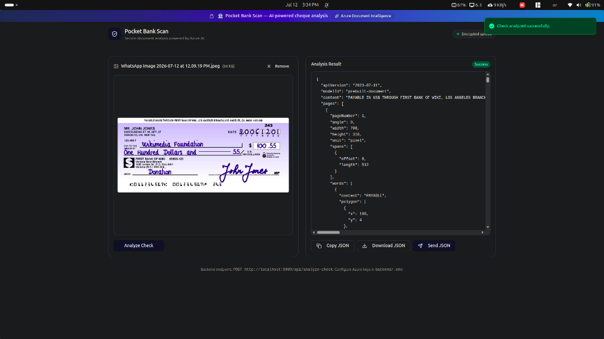

# 🏦 Pocket Bank Scan

A production-ready **Banking Check Scanner** that uses **Azure AI Document Intelligence** to extract structured data from cheque images.



---

## 🗂️ Project Structure

```
pocket-bank-scan-main/
├── backend/               # Node.js + Express + TypeScript API
│   ├── src/server.ts      # Express server & /api/analyze-check endpoint
│   ├── .env               # 🔒 Your Azure credentials (never commit this)
│   └── .env.example       # Template for env variables
└── src/                   # React + TypeScript + Vite frontend
    ├── routes/            # TanStack Router pages
    └── components/        # UI components (shadcn/ui + Radix)
```

---

## ⚙️ Tech Stack

| Layer    | Technology                                      |
|----------|-------------------------------------------------|
| Frontend | React 19, TypeScript, Vite, Tailwind CSS v4, TanStack Router, Axios |
| Backend  | Node.js, Express, TypeScript, `tsx` (dev runner) |
| AI/OCR   | Azure AI Document Intelligence (`prebuilt-document` model) |
| UI Kit   | shadcn/ui + Radix UI + Lucide icons             |

---

## 🔑 Environment Variables

The backend reads credentials from `backend/.env`.  
Copy the example file and fill in your Azure values:

```bash
cd backend
cp .env.example .env
```

Then edit `backend/.env`:

```env
AZURE_DOCUMENT_INTELLIGENCE_ENDPOINT=https://<your-resource>.cognitiveservices.azure.com/
AZURE_DOCUMENT_INTELLIGENCE_API_KEY=<your-32-char-key>
PORT=5000
```

> **Where to get these values:**
> 1. Go to the [Azure Portal](https://portal.azure.com) → your Document Intelligence resource.
> 2. Click **Keys and Endpoint** in the left panel.
> 3. Copy **Endpoint** and either **KEY 1** or **KEY 2**.

---

## 🚀 Running Locally

### ⚡ Quick Start

From the root directory, open **two terminal windows** and run:

**Terminal 1 — Backend:**
```bash
npm run install:all   # Install all packages (frontend + backend) at once
npm run dev:backend   # Start the Express server on port 5000
```

**Terminal 2 — Frontend:**
```bash
npm run dev           # Start the Vite dev server on port 8080
```

Open your browser and navigate to **http://localhost:8080** 🎉

---

### 🔧 Step-by-Step

**1 — Backend (port 5000)**
```bash
cd backend
npm install
npm run dev
```
Verify it is running:
```
Check scanner backend listening on http://localhost:5000
```
Health check: `GET http://localhost:5000/api/health` → `{ "ok": true }`

**2 — Frontend (port 8080)**

In a separate terminal from the root directory:
```bash
npm install
npm run dev
```
Open **http://localhost:8080** in your browser.

---

## 🌐 API Reference

### `POST /api/analyze-check`

Sends a cheque image to Azure Document Intelligence and returns the raw analysis result.

| Field   | Value                              |
|---------|------------------------------------|
| Method  | `POST`                             |
| URL     | `http://localhost:5000/api/analyze-check` |
| Body    | `multipart/form-data`              |
| Field   | `image` (PNG / JPG / JPEG, max 20 MB) |

**Success response:** `200 OK` — raw Azure `AnalyzeResult` JSON.  
**Error responses:** `400` (bad file), `413` (file too large), `500` (missing credentials or Azure error).

### `GET /api/health`

Returns `{ "ok": true }` — use to verify the backend is running.

---

## 🖥️ Frontend API Base URL

The frontend posts to `http://localhost:5000` by default.  
Override it by setting `VITE_API_BASE` in a root `.env` file:

```env
VITE_API_BASE=http://localhost:5000
```

---

## 📦 Key Scripts

| Location   | Command                  | Description                              |
|------------|--------------------------|------------------------------------------|
| `/`        | `npm run install:all`    | ✅ Install frontend + backend dependencies at once |
| `/`        | `npm run dev`            | Run Vite dev server (frontend :8080)     |
| `/`        | `npm run dev:backend`    | Run Express dev server (backend :5000)   |
| `/`        | `npm run build`          | Build production frontend bundle        |
| `backend/` | `npm run dev`            | Run Express dev server directly from backend directory |
| `backend/` | `npm run build`          | Compile backend TypeScript to `dist/`   |

---

## 🔒 Security Notes

- **Never commit `backend/.env`** — it contains your Azure API key. It is already listed in `.gitignore`.
- Rotate your key immediately if it is accidentally exposed.
- For production, use environment variables injected by your hosting platform (e.g. Azure App Service, Railway, Render) instead of a `.env` file.
